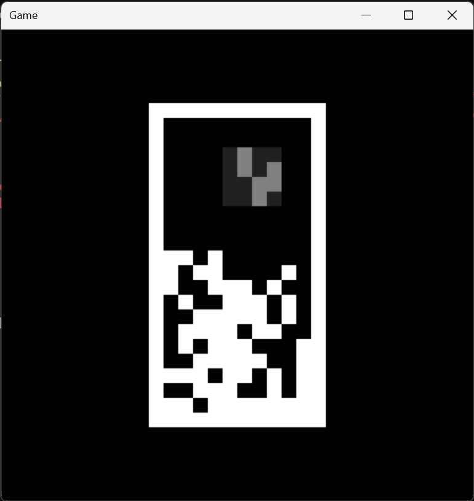

# PowerShellでゲームを作る

## 概要

PowerShellで簡単なゲームを作りたい。
PowerShellはゲームを作るのには向いていない。
なぜこんなことをするかというと、
OSに標準で入っている機能だけでゲームを作るということに魅力を感じるからだ。

## 作ったゲーム



テトリスを一般化したもの。
ブロックが4x4の領域にランダムに生成されたものになっている。
1ライン揃えるのも難しい。代わりに、自動落下せず、上にも移動できる。
Cキーで自分のタイミングで固着できる。それでも難しい。

## 必要なもの

* RGB配列を一定間隔で画面に表示
* キー入力を取得

これらは、PowerShellから利用できる.NET Frameworkの `System.Windows.Forms`、`System.Drawing`
の機能を利用することで実現できる。

## 雛形となるコード

```powershell
Add-Type -AssemblyName System.Windows.Forms
Add-Type -AssemblyName System.Drawing

$bmp = [Drawing.Bitmap]::new(32, 32)
$bmpScale = 16
$imageData = [byte[]]::new($bmp.Width * $bmp.Height * 4)

function ClearImageData($r, $g, $b) {
  for ($i = 0; $i -lt $imageData.Length; $i += 4) {
    $imageData[$i + 0] = $b
    $imageData[$i + 1] = $g
    $imageData[$i + 2] = $r
    $imageData[$i + 3] = 255
  }
}

function SetPixelToImageData($x, $y, $r, $g, $b) {
  $i = ($y * $bmp.Width + $x) * 4
  $imageData[$i + 0] = $b
  $imageData[$i + 1] = $g
  $imageData[$i + 2] = $r
  $imageData[$i + 3] = 255
}

function DrawImageData($graphics) {
  $bmpData = $bmp.LockBits(
    [Drawing.Rectangle]::new(0, 0, $bmp.Width, $bmp.Height),
    [Drawing.Imaging.ImageLockMode]::WriteOnly,
    $bmp.PixelFormat
  )
  $ptr = $bmpData.Scan0
  $bytes = [Math]::Abs($bmpData.Stride) * $bmp.Height
  [Runtime.InteropServices.Marshal]::Copy($imageData, 0, $ptr, $bytes)
  $bmp.UnlockBits($bmpData)
  $graphics.InterpolationMode = [Drawing.Drawing2D.InterpolationMode]::NearestNeighbor
  $graphics.PixelOffsetMode = [Drawing.Drawing2D.PixelOffsetMode]::Half
  $graphics.DrawImage($bmp, 0, 0, $bmp.Width * $bmpScale, $bmp.Height * $bmpScale);
}

$keys = [int[]]::new(256)

# https://github.com/PowerShell/PowerShell/issues/21140
Add-Type -Language CSharp -ReferencedAssemblies System.Windows.Forms @'
  using System.Windows.Forms;
  public class DoubleBufferedForm : Form {
    public DoubleBufferedForm() {
      this.SetStyle( 
        ControlStyles.DoubleBuffer |
        ControlStyles.AllPaintingInWmPaint,
        true
      );
      this.UpdateStyles();
    }
  }
'@

function ShowForm() {
  $form = [DoubleBufferedForm]::new()
  $form.FormBorderStyle = [Windows.Forms.FormBorderStyle]::FixedDialog
  $form.Text = 'Game'
  $form.ClientSize = [Drawing.Size]::new($bmp.Width * $bmpScale, $bmp.Height * $bmpScale)
  $form.StartPosition = 'CenterScreen'
  $form.Add_KeyDown({ param ($form, $event); $keys[$event.KeyValue] = 1 })
  $form.Add_KeyUp({ param ($form, $event); $keys[$event.KeyValue] = 0 })
  $form.Add_Paint({ param ($sender, $event); Update $event.Graphics })
  $form.Topmost = $true
  $timer = [Windows.Forms.Timer]::new()
  $timer.Interval = 100;
  $timer.Add_Tick({ $form.Invalidate($true) })
  $timer.Start()
  $form.ShowDialog()
}

function Update($graphics) {
  ClearImageData 0 0 0
  # ...
  DrawImageData $graphics
}

ShowForm
```

これであとは `Update` 部分に更新処理を書けばゲームが作れる。

例えば、左キーが押されたかどうかは、

```
  if ($keys[[int][Windows.Forms.Keys]::Left]) { }
```

で判定できる。

例えば、(5, 5)の位置に赤いピクセルを表示したい場合は、

```
  SetPixelToImageData 5 5 255 0 0
```

とすればよい。

## チラつき対策

チラつきをなくすためには `Form` をダブルバッファリングにしなければいけない。
ダブルバッファリングにするためには `Form` を `SetStyle` で変更する必要がある。
`Form` の `SetStyle` は `protected` なので継承しないと呼べない。
しかし、PowerShellは、現時点で、

https://github.com/PowerShell/PowerShell/issues/21140

に書かれているような事情により、`Add-Type` で追加されたクラスをクラス定義時に認識できない。
なので、PowerShellでは `Add-Type` されたクラスを継承することができない。

仕方がないので、C#のコードで継承を記載して、それを、

```
Add-Type -Language CSharp -ReferencedAssemblies System.Windows.Forms @'
  using System.Windows.Forms;
  public class DoubleBufferedForm : Form {
    public DoubleBufferedForm() {
      this.SetStyle( 
        ControlStyles.DoubleBuffer |
        ControlStyles.AllPaintingInWmPaint,
        true
      );
      this.UpdateStyles();
    }
  }
'@
```

のように `Add-Type` することで回避している。
なんとかPowerShellだけで書きたいものだけれど、チラつきをなくすことも重要なので仕方ない。
（これをするなら＆これができるなら全てC#で書いてもよいのではないかという気持ちにもなってしまうが）

## 起動

PowerShellのスクリプトはそのままでは起動できない。

ファイル `game.bat` を作り、

```
powershell -ExecutionPolicy Unrestricted -File game.ps1
```

のように記載しておけば、`game.bat` 経由で起動できるようになる。

## リポジトリ

https://github.com/htsnul/ps_block_game

## まとめ

PowerShellで簡単なゲームが作れた。

